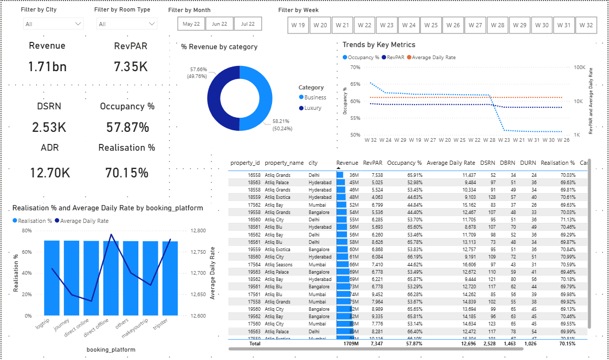

# 🏨 Hospitality Analytics Dashboard (Power BI Project)

An interactive **Hospitality Performance Dashboard** built using **Power BI** to analyze hotel revenue performance, occupancy trends, booking platform efficiency, and property-level performance.

The dashboard helps hospitality businesses monitor key industry KPIs such as **RevPAR, ADR, Occupancy Rate, and Realisation %** to support **data-driven decision making in pricing, marketing, and operations.**

---

# 🚀 Project Overview

The **Hospitality Dashboard** provides a centralized analytical view of hotel business performance across multiple properties and booking channels.

It enables users to:

* Track **hotel revenue performance**
* Analyze **room occupancy trends**
* Evaluate **booking platform performance**
* Compare **business vs luxury customer segments**
* Monitor **property-level operational metrics**

This project demonstrates how **Power BI can transform hospitality data into actionable insights for revenue management and strategic planning.**

---

# 🎯 Project Objectives

The main objectives of this dashboard are:

* Monitor **overall revenue performance**
* Track **RevPAR and ADR metrics**
* Analyze **occupancy trends**
* Compare **revenue contribution by category**
* Evaluate **booking platform effectiveness**
* Identify **top-performing properties**

---

# 🛠️ Tech Stack

The dashboard was built using the following tools and technologies:

**📊 Power BI Desktop**
Main platform used for building interactive dashboards and visualizations.

**📂 Power Query**
Used for data transformation, cleaning, and preparation.

**🧠 DAX (Data Analysis Expressions)**
Used to create calculated measures and KPIs such as Revenue, RevPAR, ADR, and Occupancy Rate.

**🧩 Data Modeling**
Relationships were created between tables such as bookings, properties, and date tables to enable cross-filtering.

**📁 File Formats**

* `.png` – Dashboard preview image

---

# 📂 Data Source

The dataset contains hotel operational data including:

* Property information
* Booking platforms
* Room types
* Weekly booking data
* Revenue and occupancy metrics
* Customer category segmentation

Multiple tables are connected through **data modeling relationships** to enable interactive filtering and analysis.

---

# ⭐ Features / Highlights

## Business Problem

Hotels generate large volumes of booking and operational data across multiple properties, booking platforms, and customer segments. However, without proper analytics tools, hotel managers struggle to quickly answer key business questions such as:

* Which properties generate the highest revenue?
* What is the occupancy performance across cities?
* Which booking platforms generate the most bookings?
* How do **RevPAR and ADR trends change over time?**
* Which customer segment contributes more revenue?

Analyzing this information manually from raw data is inefficient and time-consuming.

---

## Goal of the Dashboard

The goal of this dashboard is to create an **interactive hospitality analytics tool** that:

* Provides a **centralized view of hotel performance**
* Tracks important hospitality KPIs
* Enables **analysis of revenue trends over time**
* Identifies **high-performing booking platforms**
* Helps hotel managers make **data-driven decisions**

---

## Walkthrough of Key Visuals

### KPI Cards (Top Section)

The dashboard highlights key hospitality metrics:

* **Revenue:** 1.71B
* **RevPAR:** 7.35K
* **DSRN:** 2.53K
* **ADR:** 12.70K
* **Occupancy Rate:** 57.87%
* **Realisation %:** 70.15%

These KPIs provide a **quick overview of overall hotel performance.**

---

### Revenue Distribution by Category

A **donut chart** displays revenue contribution by:

* **Business category**
* **Luxury category**

This helps understand **which customer segment contributes more revenue.**

---

### Trends by Key Metrics

A **multi-line chart** tracks performance of:

* Occupancy %
* RevPAR
* Average Daily Rate (ADR)

This helps analyze **weekly performance trends and demand patterns.**

---

### Realisation % and ADR by Booking Platform

A **combined column and line chart** compares booking platforms such as:

* Logtrip
* Journey
* Direct Online
* Direct Offline
* Others
* MakeYourTrip
* Tripster

This helps identify **which booking platforms drive higher revenue efficiency.**

---

### Property Performance Table

A detailed table shows **property-level performance metrics**, including:

* Property name
* City
* Revenue
* RevPAR
* Occupancy %
* ADR
* Realisation %

This allows deeper **operational analysis across hotel properties.**

---

### Revenue by Week and Category

A **line chart** compares weekly revenue trends between:

* Business category
* Luxury category

This helps analyze **customer segment performance over time.**

---

## Business Impact & Insights

This dashboard enables hospitality managers to make **better strategic decisions**:

### Revenue Optimization

Monitoring ADR and RevPAR helps improve **pricing strategies**.

### Channel Performance Analysis

Identifying high-performing booking platforms helps optimize **marketing spend and partnerships**.

### Operational Performance Monitoring

Property-level insights help identify **top-performing and underperforming hotels.**

### Demand Pattern Identification

Weekly revenue trends reveal **seasonal demand patterns**, helping hotels plan promotions and pricing strategies.

### Data-Driven Decision Making

The dashboard converts raw hospitality data into **clear insights for better business planning.**

---

# 📷 Dashboard Preview

## Hospitality Analytics Dashboard

---

# 📌 Future Improvements

Possible future enhancements include:

* Profitability analysis
* Customer segmentation analytics
* Demand forecasting models
* Geographic visualization of properties
* Predictive pricing strategies

---
If you'd like, I can also help you build a **very strong GitHub Data Analyst portfolio structure (3–4 projects + clean README layout)** that recruiters usually expect.
